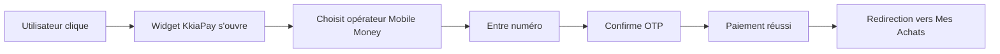

# 🚀 Démarrage Rapide - KkiaPay

## ✅ Le widget devrait maintenant s'afficher !

### Ce qui a été corrigé :

1. **Widget affiché pour MTN Mobile Money** ✓
   - Le widget KkiaPay s'affiche maintenant pour tous les providers: MTN_MOMO, Orange Money, Wave, Moov

2. **Composant KkiapayWidget corrigé** ✓
   - Utilise les bons attributs selon la documentation KkiaPay
   - Affiche un bouton "💳 Payer Maintenant" cliquable

3. **Backend mis à jour** ✓
   - Tous les providers Mobile Money utilisent KkiaPay

---

## 🧪 Test immédiat (3 étapes)

### Étape 1: Ouvrir l'application
```
http://localhost:4000/player/shop
```

### Étape 2: Acheter un jeu
1. Cliquez sur un jeu
2. Sélectionnez un package
3. Cliquez sur **Confirmer**
4. Sélectionnez **MTN Mobile Money** (ou autre méthode)
5. Cliquez sur **Confirmer l'Achat**

### Étape 3: Vous devriez voir
```
┌─────────────────────────────────────┐
│  Paiement en ligne                  │
│  Fournisseur: MTN_MOMO              │
│  Montant: 500 XOF                   │
│                                     │
│  Paiement sécurisé via KkiaPay -    │
│  Accepte tous les opérateurs        │
│  Mobile Money                       │
│                                     │
│  ┌─────────────────────────────┐   │
│  │  💳 Payer Maintenant         │   │  <-- CE BOUTON !
│  └─────────────────────────────┘   │
└─────────────────────────────────────┘
```

---

## 🎯 Si le bouton ne s'affiche toujours pas

### Vérification 1: Console navigateur
1. Appuyez sur **F12**
2. Allez dans l'onglet **Console**
3. Cherchez des erreurs en rouge
4. Partagez-les si vous en voyez

### Vérification 2: Script KkiaPay chargé
Dans la console, tapez :
```javascript
window.openKkiapayWidget
```

Résultat attendu : `function() { ... }`  
Si `undefined` → Le script n'est pas chargé

### Vérification 3: Clé API présente
Dans la console, tapez :
```javascript
import.meta.env.NEXT_PUBLIC_KKIAPAY_PUBLIC_KEY
```

Résultat attendu : `"9d566a94b64a9a8ebf552e4a4a8acdecf0d3337383"`  
Si vide → Redémarrer le serveur dev

---

## 🔄 Redémarrer le serveur (Important!)

Les modifications nécessitent un **redémarrage complet** :

```bash
# 1. Arrêter le serveur (Ctrl+C)

# 2. Nettoyer le cache (optionnel mais recommandé)
cd createxyz-project/_/apps/web
rm -rf .react-router

# 3. Redémarrer
npm run dev
```

---

## 📱 Test en mode sandbox

### Numéros de test KkiaPay:
```
✅ SUCCES:  97000000 (ou tout numéro commençant par 97)
❌ ECHEC:   96000000 (ou tout numéro commençant par 96)
```

### Processus de paiement:
1. Cliquez sur "💳 Payer Maintenant"
2. Fenêtre KkiaPay s'ouvre
3. Choisissez l'opérateur (MTN, Orange, Moov, Wave)
4. Entrez: `97000000`
5. Code OTP: `123456` (sandbox)
6. Paiement validé ✅

---

## 🎨 Ce que le widget fait



---

## 🐛 Problèmes courants

### Le bouton ne s'affiche pas du tout
**Cause:** Le serveur dev n'a pas redémarré  
**Solution:**
```bash
cd createxyz-project/_/apps/web
# Ctrl+C pour arrêter
npm run dev
```

### Le bouton s'affiche mais rien ne se passe au clic
**Cause:** Script KkiaPay pas chargé  
**Solution:** 
1. Vérifiez dans `root.tsx` ligne 390
2. Rafraîchir la page (F5)
3. Vider le cache (Ctrl+Shift+R)

### Erreur "apiKey is required"
**Cause:** Variable d'environnement manquante  
**Solution:**
Vérifiez `.env.local`:
```env
NEXT_PUBLIC_KKIAPAY_PUBLIC_KEY=9d566a94b64a9a8ebf552e4a4a8acdecf0d3337383
NEXT_PUBLIC_KKIAPAY_SANDBOX=1
```

---

## 📸 Screenshot attendu

Vous devriez voir quelque chose comme ceci:

```
┌─────────────────────────────────────────┐
│ 💳 Paiement                              │
├─────────────────────────────────────────┤
│                                         │
│ Récapitulatif                           │
│ Jeu: Call of Duty Modern Warfare        │
│ Package: Package Standard               │
│ Durée: 60 min                           │
│ Points à gagner: ⭐ +50                  │
│ ─────────────────────────────────────   │
│ Total: 500 XOF                          │
│                                         │
│ Méthode de Paiement                     │
│ ☑ MTN Mobile Money                      │
│                                         │
│ ┌─────────────────────────────────────┐ │
│ │ 💳 Paiement en ligne                 │ │
│ │ Fournisseur: MTN_MOMO                │ │
│ │ Montant: 500 XOF                     │ │
│ │                                      │ │
│ │ Paiement sécurisé via KkiaPay -      │ │
│ │ Accepte tous les opérateurs          │ │
│ │ Mobile Money                         │ │
│ │                                      │ │
│ │ ┌──────────────────────────────────┐ │ │
│ │ │  💳 Payer Maintenant              │ │ │  <-- BOUTON !
│ │ └──────────────────────────────────┘ │ │
│ └─────────────────────────────────────┘ │
└─────────────────────────────────────────┘
```

---

## ✅ Checklist de vérification

- [ ] Serveur dev redémarré
- [ ] Page rafraîchie (F5)
- [ ] Console sans erreurs
- [ ] `window.openKkiapayWidget` existe
- [ ] Clé API présente dans .env.local
- [ ] Bouton "💳 Payer Maintenant" visible
- [ ] Clic ouvre la fenêtre KkiaPay

---

## 📞 Support

**Si ça ne fonctionne toujours pas:**
1. Copiez les erreurs de la console (F12)
2. Faites un screenshot de ce que vous voyez
3. Partagez-les pour un diagnostic précis

**Documentation:**
- Locale: `INTEGRATION_KKIAPAY.md`
- KkiaPay: https://docs.kkiapay.me

---

**Dernière mise à jour:** 20 Octobre 2025, 15:00  
**Statut:** Widget corrigé et prêt à l'emploi 🚀
