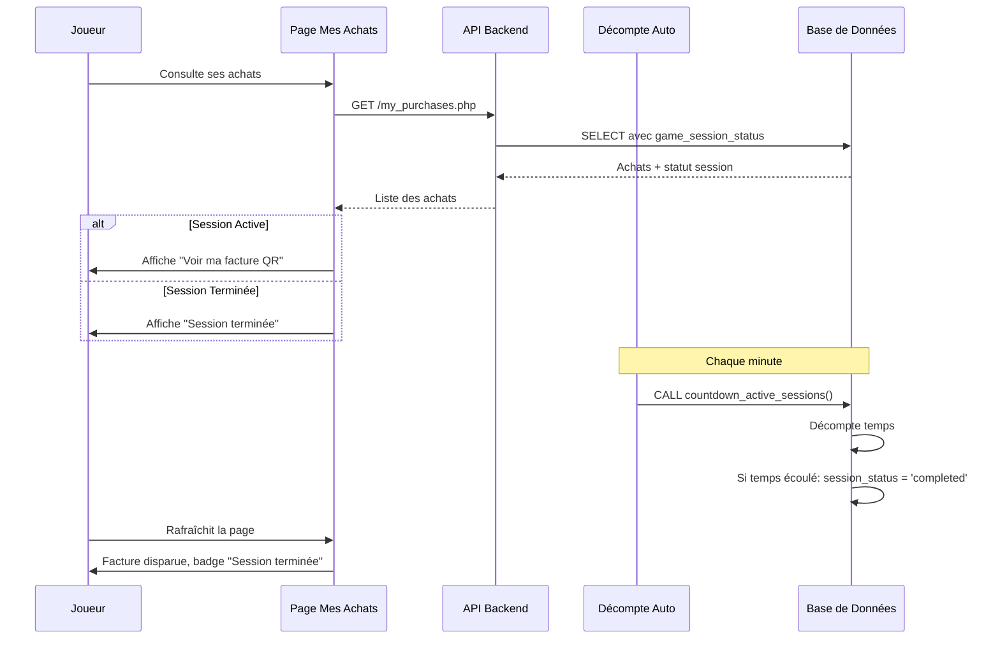

# ✅ Factures Disparaissent Après le Temps de Jeu

## 📋 Problème Résolu

Les factures avec codes QR disparaissent maintenant automatiquement chez le joueur une fois que le temps de jeu est terminé, **tout en préservant l'historique complet des achats**.

---

## 🔧 Modifications Apportées

### 1. **API Backend - `my_purchases.php`**
📁 `api/shop/my_purchases.php`

**Changement:**
- Ajout de `game_session_status` et `session_remaining_minutes` dans la requête SQL
- Permet au frontend de savoir si la session est terminée

```php
LEFT JOIN game_sessions gs ON p.id = gs.purchase_id
```

---

### 2. **Page "Mes Achats" - React**
📁 `createxyz-project\_\apps\web\src\app\player\my-purchases\page.jsx`

**Changements:**
- Le bouton **"Voir ma facture QR"** n'apparaît que si la session est **active, ready ou en pause**
- Une fois la session **completed, expired ou terminated**, un badge "Session terminée" s'affiche à la place
- L'historique de l'achat reste visible avec tous les détails (prix, durée, points gagnés)

**Conditions d'affichage:**
```javascript
// Facture visible UNIQUEMENT si session active
['ready', 'active', 'paused'].includes(purchase.game_session_status)

// Badge "Session terminée" si temps écoulé
['completed', 'expired', 'terminated'].includes(purchase.game_session_status)
```

---

### 3. **Page "Mes Factures" - React**
📁 `createxyz-project\_\apps\web\src\app\player\my-invoices\page.jsx`

**Changements:**
- Le bouton **"Afficher QR Code"** disparaît quand la session est terminée
- Un badge gris **"Session Terminée"** s'affiche à la place du bouton QR
- La facture reste dans l'historique mais n'est plus utilisable

**Logique:**
```javascript
const canShowQR = ['pending', 'active'].includes(invoice.status) && 
                  (!invoice.session_status || 
                   !['completed', 'expired', 'terminated'].includes(invoice.session_status));
```

---

### 4. **Procédure SQL de Décompte Automatique**
📁 `api/migrations/add_invoice_procedures.sql`

**Changements:**
- Quand le temps de jeu est écoulé (compteur automatique), met à jour `purchases.session_status = 'completed'`
- Quand une session expire, met à jour `purchases.session_status = 'expired'`
- Synchronisation automatique entre les tables `active_game_sessions_v2` et `purchases`

**Code ajouté:**
```sql
-- Lors de la complétion automatique
UPDATE purchases SET
  session_status = 'completed',
  updated_at = NOW()
WHERE id = (SELECT purchase_id FROM active_game_sessions_v2 WHERE id = v_session_id);

-- Lors de l'expiration
UPDATE purchases SET session_status = 'expired', updated_at = NOW()
WHERE id IN (
  SELECT purchase_id FROM active_game_sessions_v2 
  WHERE status = 'expired' AND updated_at > DATE_SUB(NOW(), INTERVAL 1 MINUTE)
);
```

---

### 5. **Gestion Manuelle par Admin**
📁 `api/admin/manage_session.php`

**Changement:**
- Quand un admin termine manuellement une session (action "terminate"), met à jour `purchases.session_status = 'completed'`
- Cohérence totale entre toutes les méthodes de fin de session

---

## 🚀 Installation

### Étape 1: Mettre à Jour la Procédure SQL

Exécutez le script PHP pour mettre à jour la procédure stockée:

```bash
cd C:\xampp\htdocs\projet ismo
php update_countdown_procedure.php
```

**Résultat attendu:**
```
✓ Ancienne procédure supprimée
✓ Nouvelle procédure créée

✅ Procédure countdown_active_sessions mise à jour avec succès!
```

### Étape 2: Vérifier la Base de Données (optionnel)

Connectez-vous à phpMyAdmin et vérifiez que la procédure existe:

```sql
SHOW PROCEDURE STATUS WHERE Name = 'countdown_active_sessions';
```

---

## 🎯 Comportement Final

### Pour le Joueur - Page "Mes Achats"

| Statut Session | Bouton Facture | Badge Affiché |
|---------------|----------------|---------------|
| `ready`, `active`, `paused` | ✅ **Voir ma facture QR** | - |
| `completed`, `expired`, `terminated` | ❌ Masqué | ✅ **Session terminée** |
| `pending` (pas encore démarrée) | 🔵 **Démarrer la Session** | - |

### Pour le Joueur - Page "Mes Factures"

| Statut Session | Bouton QR Code | Badge Affiché |
|---------------|----------------|---------------|
| Session active | ✅ **Afficher QR Code** | - |
| Session terminée | ❌ Masqué | ✅ **Session Terminée** (badge gris) |

### Historique Préservé

- ✅ Tous les achats restent visibles dans "Mes Achats"
- ✅ Détails complets : jeu, durée, prix, points gagnés
- ✅ Date d'achat et statut de paiement
- ✅ Récapitulatif des statistiques (total achats, montant total, points)

---

## 🔄 Flux Complet



---

## ✅ Tests à Effectuer

1. **Créer un achat de temps de jeu court (ex: 5 min)**
2. **Démarrer la session**
3. **Vérifier que la facture est visible**
4. **Attendre que le temps s'écoule**
5. **Rafraîchir "Mes Achats"**
6. **Vérifier:**
   - ✅ Facture QR n'est plus accessible
   - ✅ Badge "Session terminée" s'affiche
   - ✅ L'achat reste dans l'historique
   - ✅ Statistiques toujours visibles

---

## 🐛 Dépannage

### La facture reste visible après la fin du temps

**Solution:**
1. Vérifier que le CRON tourne:
   ```bash
   php C:\xampp\htdocs\projet ismo\api\cron\countdown_sessions.php
   ```

2. Vérifier le log:
   ```
   C:\xampp\htdocs\projet ismo\logs\countdown_[date].log
   ```

3. Vérifier en base de données:
   ```sql
   SELECT id, session_status, updated_at 
   FROM purchases 
   WHERE user_id = [ID_USER]
   ORDER BY created_at DESC;
   ```

### La procédure ne s'est pas créée

**Solution:**
```bash
cd C:\xampp\htdocs\projet ismo
php update_countdown_procedure.php
```

Si erreur, vérifiez les permissions MySQL et que l'utilisateur a le droit `CREATE ROUTINE`.

---

## 📊 Impact sur les Performances

- ✅ **Aucun impact négatif** - Les requêtes utilisent des JOIN simples
- ✅ **Calculs légers** - Simple vérification de statut
- ✅ **Cache-friendly** - Les données sont statiques une fois la session terminée
- ✅ **Scalable** - La logique est dans la procédure SQL (optimisée)

---

## 🎉 Résultat

Les joueurs ne peuvent plus consulter/scanner leurs factures QR une fois leur temps de jeu écoulé, mais gardent un **historique complet et détaillé** de tous leurs achats pour consultation future.
