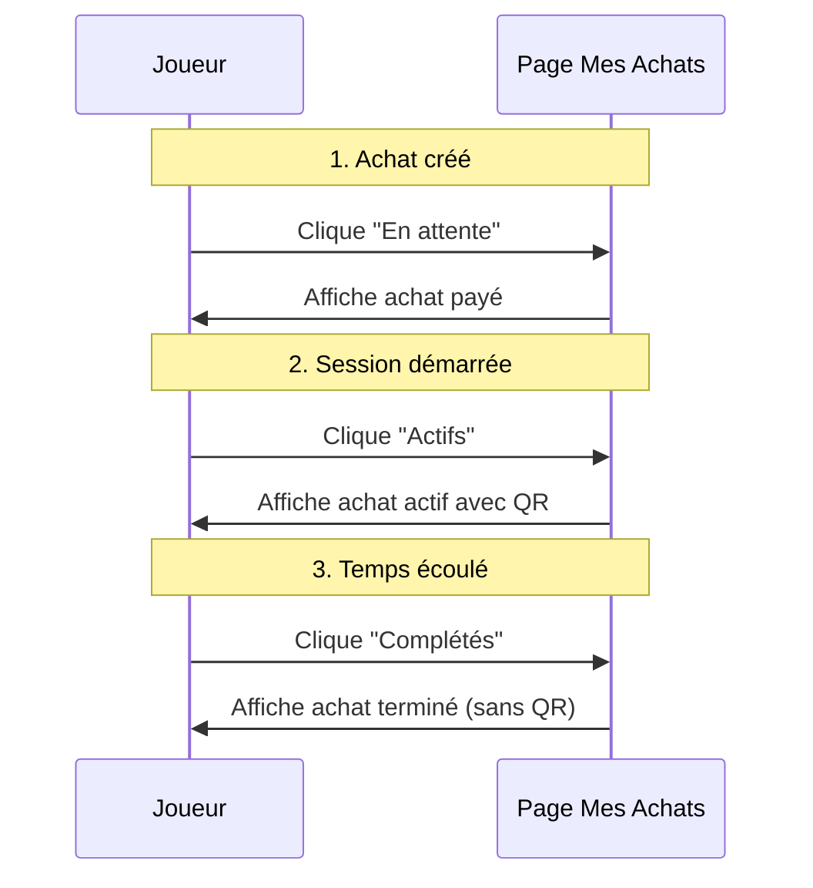

# ✅ Filtrage des Achats par Statut de Session

## 📋 Nouvelle Fonctionnalité

La page **"Mes Achats"** filtre maintenant les achats selon le **statut de la session de jeu** plutôt que le statut de paiement.

---

## 🎯 Nouveau Système de Filtres

### **1. 🟢 Actifs** (Session en cours)
Affiche uniquement les achats dont la session est :
- ✅ `ready` - Prête à démarrer
- ✅ `active` - En cours d'utilisation
- ✅ `paused` - En pause

**Caractéristiques :**
- Bouton **"Voir ma facture QR"** visible
- Temps de jeu restant affiché
- Possibilité de scanner le QR Code

---

### **2. ✅ Complétés** (Session terminée)
Affiche uniquement les achats dont la session est :
- ✅ `completed` - Temps écoulé normalement
- ✅ `expired` - Session expirée
- ✅ `terminated` - Terminée manuellement par admin

**Caractéristiques :**
- Badge **"Session terminée"** affiché
- Bouton facture QR **masqué**
- Historique complet préservé
- Détails de l'achat toujours visibles

---

### **3. ⏳ En attente**
Affiche les achats :
- 🟡 `payment_status = pending` - Paiement en attente
- 🟡 `session_status = pending` - Payé mais pas encore démarré

**Caractéristiques :**
- Bouton **"Démarrer la Session"** visible
- En attente de confirmation de paiement

---

### **4. 📋 Tous**
Affiche tous les achats sans filtrage.

---

## 🔧 Modifications Techniques

### Fichier Modifié
📁 `createxyz-project\_\apps\web\src\app\player\my-purchases\page.jsx`

### Changements Principaux

#### **1. Fonction `loadPurchases()` - Filtrage côté client**

```javascript
const loadPurchases = async () => {
  // Charger TOUS les achats depuis l'API
  const res = await fetch(`${API_BASE}/shop/my_purchases.php`, { 
    credentials: 'include' 
  });
  const data = await res.json();
  
  // Filtrer localement selon le statut
  let filteredPurchases = data.purchases;
  
  if (filter === 'active') {
    // Sessions actives uniquement
    filteredPurchases = data.purchases.filter(p => 
      p.payment_status === 'completed' && 
      p.game_session_status && 
      ['ready', 'active', 'paused'].includes(p.game_session_status)
    );
  } 
  else if (filter === 'completed') {
    // Sessions terminées uniquement
    filteredPurchases = data.purchases.filter(p => 
      p.game_session_status && 
      ['completed', 'expired', 'terminated'].includes(p.game_session_status)
    );
  } 
  else if (filter === 'pending') {
    // Achats en attente
    filteredPurchases = data.purchases.filter(p => 
      p.payment_status === 'pending' || 
      (p.payment_status === 'completed' && p.session_status === 'pending')
    );
  }
  
  setPurchases(filteredPurchases);
};
```

---

#### **2. Nouveaux Boutons de Filtre avec Icônes**

```jsx
{/* Actifs */}
<button onClick={() => setFilter('active')}>
  <Play className="w-4 h-4" />
  Actifs
</button>

{/* Complétés */}
<button onClick={() => setFilter('completed')}>
  <CheckCircle className="w-4 h-4" />
  Complétés
</button>

{/* En attente */}
<button onClick={() => setFilter('pending')}>
  <Clock className="w-4 h-4" />
  En attente
</button>
```

---

#### **3. Messages Personnalisés**

Selon le filtre actif, le message d'absence d'achats s'adapte :

| Filtre | Message Affiché |
|--------|----------------|
| `active` | "Aucune session active" |
| `completed` | "Aucune session terminée" |
| `pending` | "Aucun achat en attente" |
| Aucun | "Aucun achat" + bouton boutique |

---

## 🎨 Interface Utilisateur

### Apparence des Filtres

```
╔════════════════════════════════════════════════╗
║  [Tous] [▶️ Actifs] [✓ Complétés] [🕐 En attente]  ║
╚════════════════════════════════════════════════╝
```

- **Filtre actif** : Fond blanc, texte violet
- **Filtre inactif** : Fond violet, texte blanc

---

## 🚀 Flux Utilisateur

### Scénario 1 : Achat → Utilisation → Complétion



---

## ✅ Avantages du Nouveau Système

### **1. Clarté**
- ✅ Séparation nette entre sessions actives et terminées
- ✅ Facile de voir combien de sessions sont en cours
- ✅ Historique des sessions terminées accessible

### **2. Performance**
- ✅ Filtrage côté client = pas de requête serveur à chaque clic
- ✅ Rechargement uniquement quand nécessaire
- ✅ Interface réactive

### **3. Expérience Utilisateur**
- ✅ Icônes visuelles pour chaque catégorie
- ✅ Messages adaptés au contexte
- ✅ Onglets clairs et intuitifs

---

## 📊 Comparaison Avant/Après

### ❌ Ancien Système
- Filtrage par `payment_status` (completed/pending)
- Pas de distinction sessions actives vs terminées
- Bouton facture visible même après fin du jeu
- Confusion entre "complété" (payé) et "terminé" (joué)

### ✅ Nouveau Système
- Filtrage par `game_session_status`
- 3 catégories claires : Actifs, Complétés, En attente
- Bouton facture masqué après fin de session
- Séparation claire des états

---

## 🧪 Tests à Effectuer

### Test 1 : Filtre "Actifs"
1. Créer un achat et démarrer la session
2. Aller sur "Mes Achats" → "Actifs"
3. **Vérifier** : Achat affiché avec bouton "Voir ma facture QR"

### Test 2 : Filtre "Complétés"
1. Attendre que le temps de jeu se termine
2. Aller sur "Mes Achats" → "Complétés"
3. **Vérifier** : Achat affiché avec badge "Session terminée"

### Test 3 : Filtre "En attente"
1. Créer un achat mais ne pas démarrer la session
2. Aller sur "Mes Achats" → "En attente"
3. **Vérifier** : Achat affiché avec bouton "Démarrer la Session"

### Test 4 : Navigation entre filtres
1. Cliquer entre les différents onglets
2. **Vérifier** : Pas de rechargement inutile, filtrage instantané

---

## 🔧 Configuration Requise

**Aucune configuration supplémentaire nécessaire !**

Le système fonctionne avec :
- ✅ Base de données déjà mise à jour (procédure countdown)
- ✅ API `my_purchases.php` modifiée (inclut `game_session_status`)
- ✅ Hot reload automatique du serveur React

---

## 📝 Notes Techniques

### Dépendance avec d'autres modifications
Ce système s'appuie sur :
1. **`api/shop/my_purchases.php`** - Retourne `game_session_status`
2. **Procédure `countdown_active_sessions`** - Met à jour `session_status` dans `purchases`
3. **Page modifiée** - Utilise `game_session_status` pour filtrer

### Performance
- Filtrage côté client = **temps de réponse < 1ms**
- Pas de latence réseau entre changements de filtres
- Une seule requête API au chargement initial

---

## 🎉 Résultat

Les joueurs peuvent maintenant :
- 👀 **Voir facilement leurs sessions actives** (onglet Actifs)
- 📚 **Consulter leur historique complet** (onglet Complétés)
- ⏳ **Suivre leurs paiements en attente** (onglet En attente)
- 🚫 **Ne plus voir les factures QR après la fin du jeu**

Tout en gardant un **historique complet et détaillé** de tous leurs achats ! ✨
